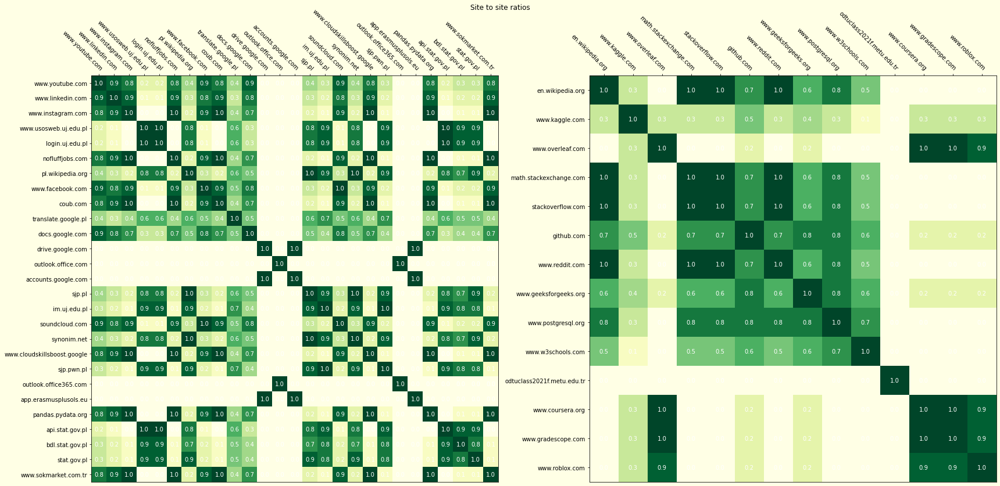
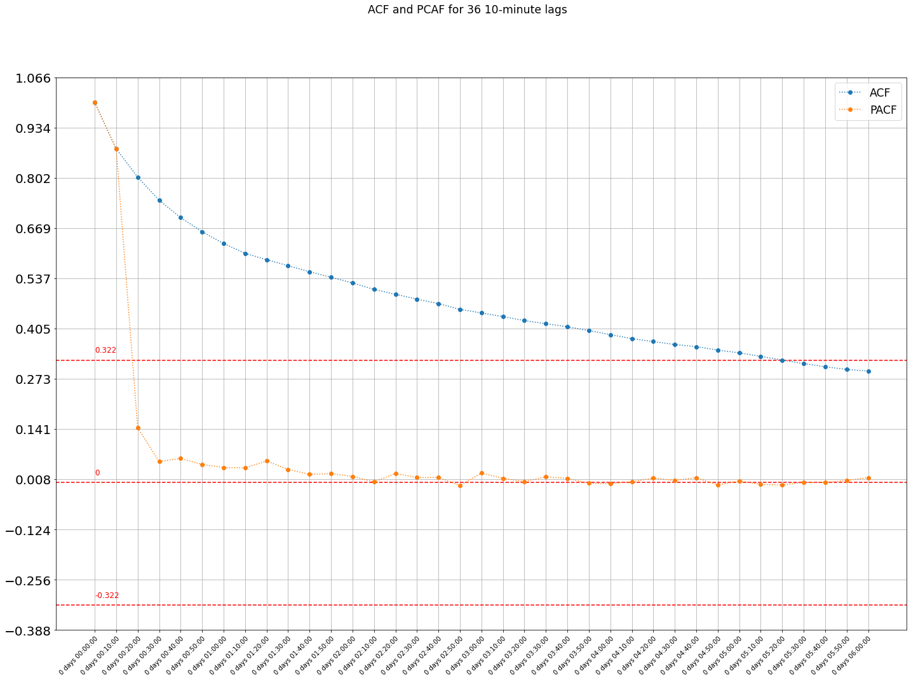

# _***BROWSER HISTORY CLUSTERING***_

## Abstract

Browser history clustering is my current machine learning project. The idea is to analyse my browser history records as a timeseries of a type of sites (for example "Learning" and "Laisure) that I visit during the day, with the types being determined by clustering the webpages based on their text contents. The main goal is to gain insights into my browsing routine via a model, measure of validity of which will be defined by its consistency with my recent experience. 

It is worth noting, that as it's still an live project, the contents of it as well as the methodology might change. For example, by rewriting the whole preprocessing parts into pipelines, which I purposively postpone to the end of the project, as the current, more verbose approach makes it easer to tinker.

The readme here serves as a private project summary, since the code itself is quite self-explainatory with its interwoven descriptions.

## The inspiration

My reasoning has been influecned by [this excellent article on document clustering](https://nlp.stanford.edu/courses/cs224n/2003/fp/millersj/cs224nfp.pdf) by Dan Siroker and Steve Miller from the University of Stanford.

### Main libraries:

- Pandas
- Matplotlib
- Scikit learn
- BeautifulSoup

## The current plan

The reasoning divides into three main parts, each resembled in separate python sketchbook files. These are:

### 1. Datamining

To assemble the end-goal timeseries two values will be necessary - the timestamps and website's type label. As the first one is already included into the browsing history .json it's the the latter one that has to be thoroughly processed. We need a downloading script, since no meaningfull clustering can be achieved by attributes provided so far. 

We have to estabilish a frame of reasoning by refering to which we will direct our approach. The clustering algorithm needs vectors to make clusters of, and as each such vector has to be associated with one visited site, we have to think about optimal creation of such. Vectorisation of a document can be done in few ways, but it will come down to measuring some features of it and constructing a vector of those values. We note that:

1.  The less sparse the similarity matrix (made up of documents' feature vectors) the better the clustering algorithm will perform. We should choose only the most important words to represent our document. Our sense of importance will be dictated by:
    - The need to represent site's visible content, not the structure. We need to get rid of any code contained in downloaded .html file.
    - Our decision not to take context into account (for simplicity, as we feel confident that a general document clustering will do), so we don't need to include interpunction or special characters in general.
    - The need to reduce noise inside the document. We'll filter for stopwords.
    - Generality of a word. We should count different forms of one word as several occurences of one word. We will stem each word.

2. Downloading should be performed in a way optimising the end-goal timeseries, so:
    - We need to get rid of noise in the browsing history. We should omit sites that don't meet a visit-frequency threshold.
    - We can create "domain buckets" that represent a domain with its various paths as one entrance along with a general content profile of each. It makes the clustering process more stable and faster, as we agree that the site-type of domain propagates downwards its to its subpages.

3. Downloading should itself be optimised, so:
    - We should trim the lenghty lurking process on one domain to one entrance (in the scope of downloading loop).
    - We should omit pages already downloaded.
    

The idea of a domain bucket is to stuff all the preprocessed subpage data(html-stipped and stemmed) to a common body representing the one domain they belong to. We also make a silent assumpton that I can't switch between multiple browser cards, ignoring situations where I could change the sitetype by switching to a card opened some time ago. After such processing, we should achieve a nice, dense similarity matrix.

### 2. Site clustering

While importing the data we should divide it into english and polish cathegories, again, for a less sparce similarity matrix. Thus we create _pl and _en corpuses.

We use sublinear TF-IDF featre weighting to construct feature vectors. The sublinearisation via a log function allows us to smooth the weights, making the difference between 20 and 22 occurences of a word less important than 0 and 2.

For the choice of the clustering algorithm we stick to the well known KMeans as it is simple, general-purpose tool suited well for a small number of clusters. Additionally we don't need the feature of dynamically choosing that number - a feature offered by few other clustering alghoritms like OPTICS. 

It would be benefitial to perform a singular value decomposition on our feature matrix before stuffing it into KMeans alghoritm as it improves its performance for high-dimensional data like ours, where we deal with over 10000 word-features for a handful of sites (or rather, the domain buckets). We could normalise them, but the work of reweighting the vectors' features has been already done by sublinear_tf flag. We settle on a set of hyperparameters by repeated trials and visualisations.

The clustering won't be very consistent, yet we have to decide on one particular grouping. To limit the variance we deploy a bagging technique, where a number of clustering models all cluster the same set of data. We later create a matrix describing how often two particular sites got clustered togather.

The value inside a cell is equal to the proportion of number of sets these two sites happen to be togather to the number of all gropings.

Basing on it, we select one particular grouping. We rate each grouping by summing ratings obtained by their clusters. One cluster's score is calculated as a sum of matrice's entrances according to each pair of sites found inside. 

We then export the selected clustering, manually labeling them according to our ovservation.

### 3. Timeseries analysis

During the preparation we'll also need to manually label the few lacking sites which didn't let their contents be downloaded by a bot or simply didn't return a 200 response code upon request. Later, using the original dataframe of the browsing history we'll delete the outliers we excluded during pre-clustering preparation  and forward-fill the gaps by aggregating the data into 10 minutes interval. The representative for an aggregated inerval is to be the mode.

Coming to the analysis part, I plan to check for cyclicality in the span of a day and a week with the use of both Autocorrelation Function and PACF. (in future I will also try to fit an ARIMA model to the data obtained).

## Plans for future

As mentioned, the project is not yet by any means considered finished. Thus instead of a summary section I list the issues:

- The data obtained this way happens to be badly degraded - over 40% of the sites is getting excluded and forward-filled at the last stage. The planned way to unravel it is to export the models associated with the best fits and perform classification on each site previously treated as an outlier with the use of it.
- The data is language-classified twice - once during datamining while selecting the stemming method and for the second time while performing the separate clusterings.
- The url_to_df() function from advertools is an overkill for separating the domain. Since it creates a dataframe with separate attributes for every unique subpage name - it is, way too many. Morover, it's used twice, instead of using the result from datamining part.

